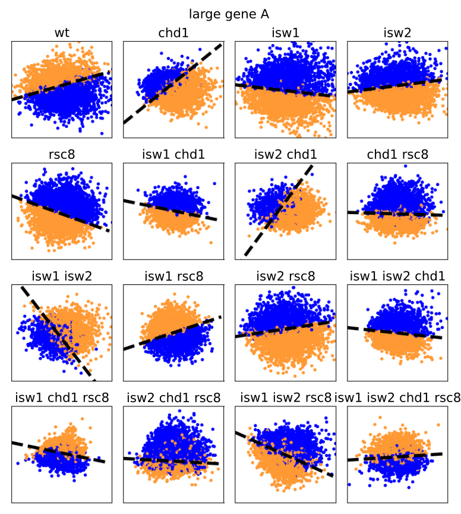

# Functional Principal Component Analysis  for Nucleosome Data

Nucleosomes package the DNA in the spatially constraining nucleus. Consequently, their dynamics determine accessibility
to the sequence and regulate other processes such as transcription and repair. Whilst much research effort
has been spent on characterising dynamics around Nucleosome Depleted Regions, it is difficult to evaluate the coordinated
phasing along the gene body. We combine Pearson correlation as average linear correlation measurement with 
location-specific fPCA.

## Pre-requirements
Download the data from Ocampo et al. (2016, 2019)[1, 2], and align profiles according to the +1 position as described in their paper.
Note that our study started from the FASTQ file, performing the mapping and quality control as in André et al. (2013).
In order to run the scripts, data should be saved in a folder called `data`.

## Requirements
Code uses `Matlab` (Pearson clustering) and `Python` (fPCA and correlation). Python code was implemented in `python3` 
(tested on `python3.8`). Matlab code was tested on `R2018a`. Necessary packages can be installed via `pip`. Run for their installation

```commandline
python3.8 -m pip install -r requirements.txt
```

## Determine Pearson Clusters
The clustering is implemented in Matlab. It's recommended to be run in the official IDE. Make sure the data is already present
in a folder called `data`, and +1-aligned profiles for each strain are in a folder named after the cell strain.
If you want to change the size of genes considered for all clusters, modify line 3 in `cluster_kmean_all_size.m`

```matlab
ORF_g = ORF(gene_size>=1000);
```

to the desired operation. Remember to change the naming of the target folder in line 7

```matlab
data_work = [char(name_dir(i).folder),'/cluster_all_ge_1000/',char(name_dir(i).name)];
```

Similarly, if you want to change the size of genes for the size-specific clustering,
change line 3 in `cluster_kmean_size.m`

```matlab
ORF_g = ORF(gene_size<1000);
```

to the desired operation. As before, remember to modify line 7 to change the target folder

```matlab 
data_work = [char(name_dir(i).folder),'/cluster_lit_1000/',char(name_dir(i).name)];
```

## Run fPCA on Pearson Cluster
The fPCA presented in the paper was performed on two clusters. Rename the cluster folder created in the previous step
for 2 clusters such that the cluster result can be found in the directory `data/mat` for clustering performed on all genes,
`data/mat_small_genes` for small genes, and `data/mat_large_genes` for large genes. Folders of the cell strains with in these
directories are named after the cell strain without the `*.bam` suffix.

For getting a feeling for the implemented analysis in a step-by-step manner, look at the provided Jupyter notebooks.
- An example case is given in `Example Case.ipynb`
- The result for different base functions is presented in `Base function comparison.ipynb`
- Conventional PCA is compared to fPCA in `Comparison fPCA and PCA.ipynb`
- We plot nucleosome phasing with respect to Pol II occupancy as required by the reviewers in `Nucleosome phasing with respect to Pol II.ipynb`


To run the clustering analysis using the Jehnsen-Shannon distance and fPCA run

```commandline
python3.8 clusterPlots.py [--parameters]
```

and run 
```commandline
python3.8 clusterPLots.py --help
```

to have all information about the cli parameters and their usage.



## Run Correlation Analysis
Correlation analysis is performed by 

```commandline
pyrhon3.8 multivariatePrediction.py [--parameters]
```

and run 
```commandline
python3.8 multivariatePrediction.py --help
```
to have all information about cli parameters and their usage.

## References
[1] Ocampo, J., Chereji, R. V., Eriksson, P. R., & Clark, D. J. (2016). The ISW1 and CHD1 ATP-dependent chromatin remodelers compete to set nucleosome spacing in vivo. Nucleic acids research, 44(10), 4625-4635.

[2] Ocampo, J., Chereji, R. V., Eriksson, P. R., & Clark, D. J. (2019). Contrasting roles of the RSC and ISW1/CHD1 chromatin remodelers in RNA polymerase II elongation and termination. Genome research, 29(3), 407-417.

[3] André, K. M., Aiach, N. G., Martinez-Fernandez, V., Zeitler, L., Alberti, A., Goldar, A., ... & Soutourina, J. (2023). Functional interplay between Mediator and RSC chromatin remodeling complex controls nucleosome-depleted region maintenance at promoters. Cell Reports, 42(5).
