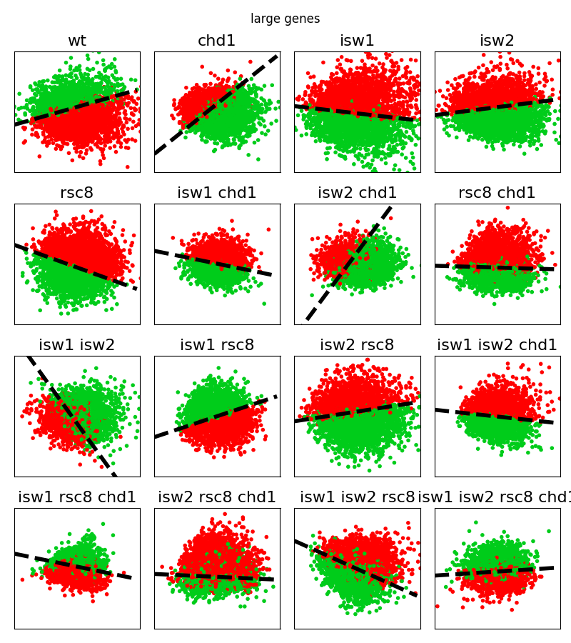

# Functional Principle Component Analysis  for Nucleosome Data

Nucleosomes package the DNA in the spatially constraining nucleus. Consequently, their dynamics determine accessibility
to the sequence and regulate other processes such as transcription and repair. Whilst much research effort
has been spent on characterising dynamics around Nucleosome Depleted Regions, it is difficult to evaluate the coordinated
phasing along the gene body. We combine Pearson correlation as average linear correlation measurement with 
location-specific fPCA.

## Requirements
Code uses `Matlab` (Pearson clustering) and `Python` (fPCA and correlation). Python code was implemented in `python3` 
(tested on `python3.8`). Necessary packages can be installed via `pip`. Run for their installation

```commandline
python3.8 -m pip install -r requirements.txt
```

## Determine Pearson Clusters
TODO

## Run fPCA on Pearson Clusters
To run the clustering analysis using the Jehnsen-Shannon distance and fPCA run

```commandline
python3.8 clusterPlots.py [--parameters]
```

and run 
```commandline
python3.8 clusterPLots.py --help
```

to have all information about the cli parameters and their usage.



## Run Correlation Analysis
Correlation analysis is performed by 

```commandline
pyrhon3.8 multivariatePrediction.py [--parameters]
```

and run 
```commandline
python3.8 multivariatePrediction.py --help
```
to have all information about cli parameters and their usage.
